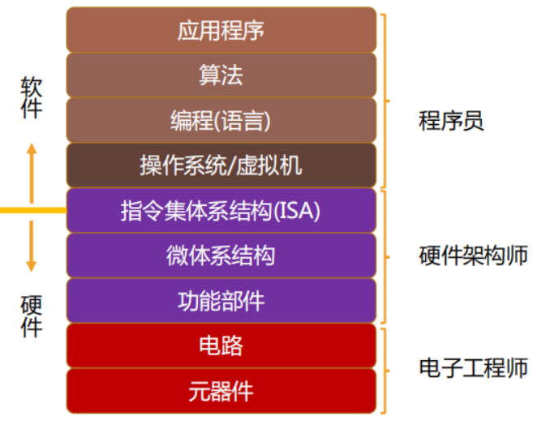
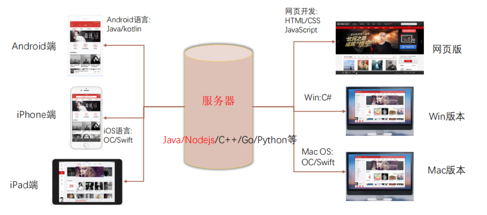

# 1. 前端开发基础

> 这一节只是一个前端学习的铺垫,  一些关于前端开发的拓展

## 1. 关于软件的了解

1. 是一系列按照特定顺序组织的电脑数据和指令，是电脑中的非有形部分. 电脑中的有形部分称为硬件，由电脑的外壳及各零件及电路所组成. 电脑软件需有硬件才能运作，反之亦然，软件和硬件都无法在不互相配合的情形下进行实际的运作.

2. 软件开发就是告诉计算机一系列的指令，这些指令也称之为程序.

3. 开发软件的这部分人就称之为 软件开发工程师，也称之为程序员.

### 1. 生活中的软件有什么

例如微信,  抖音,  王者荣耀,  网易云音乐,  淘宝,  斗鱼,  哔哩哔哩,  vscode

### 3. 软件与应用程序的区别

软件（`software`）是下图所有的部分, 而应用程序（`Application`）只是用户使用的, 面向普通的用户使用

### 4. 完整的系统软件

> 网易云为例

# @补充

css3 并没有真正意义上的标准
