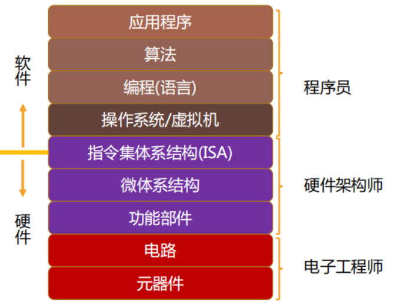
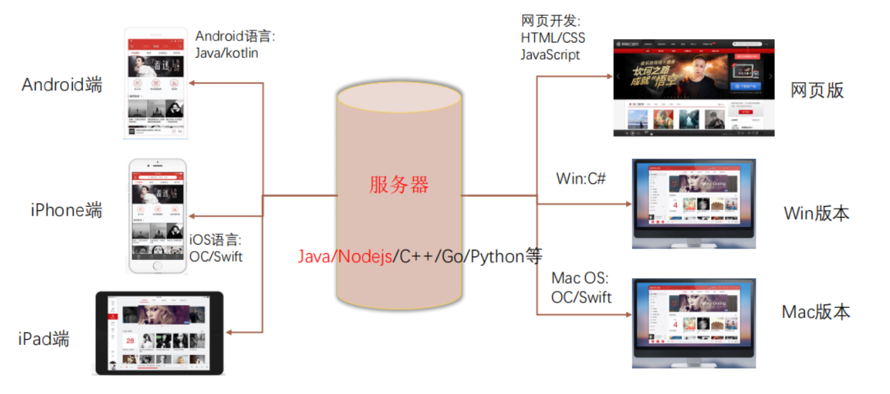
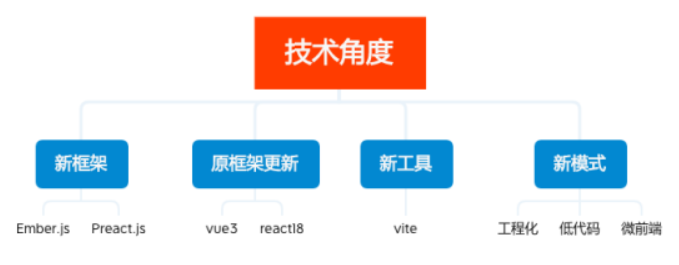
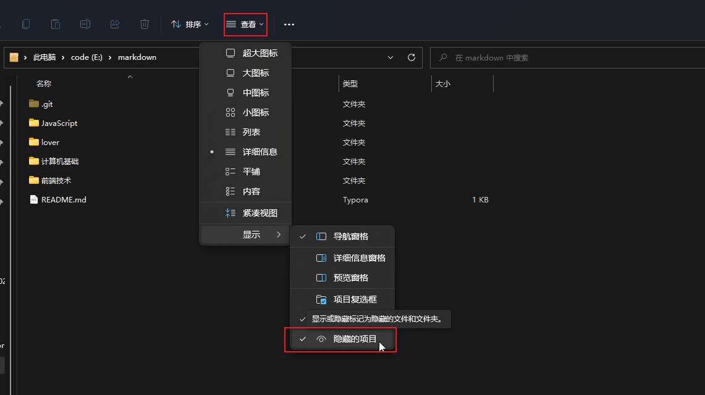
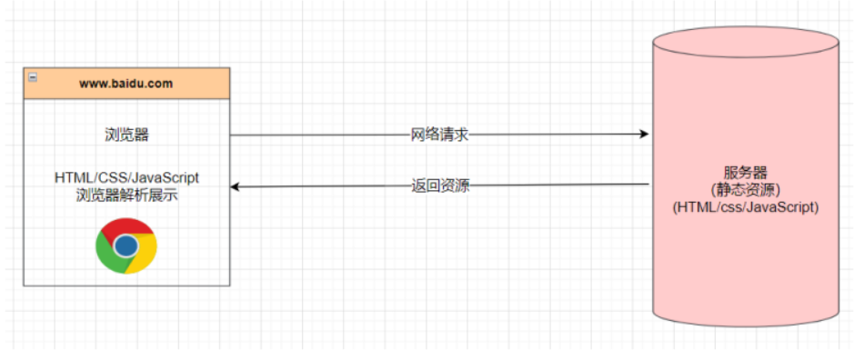
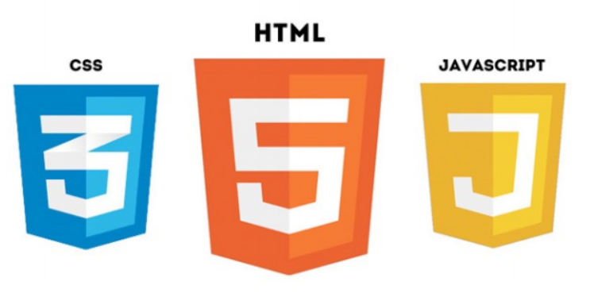
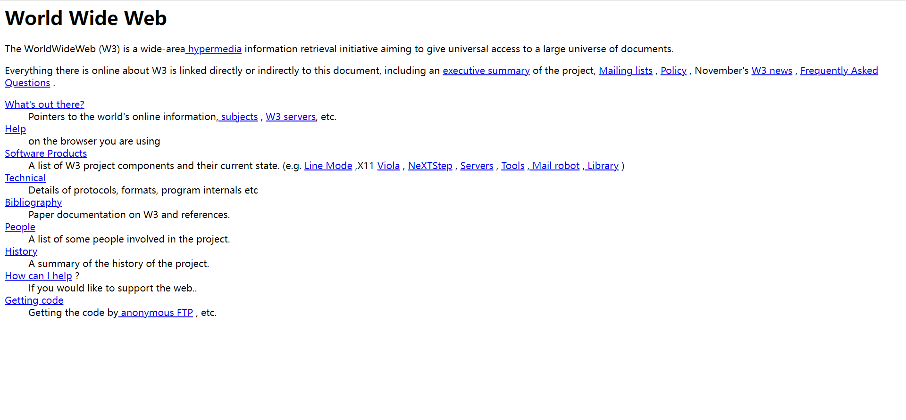
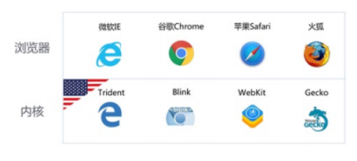
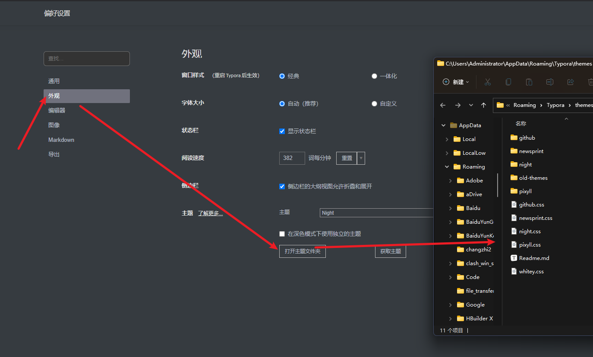
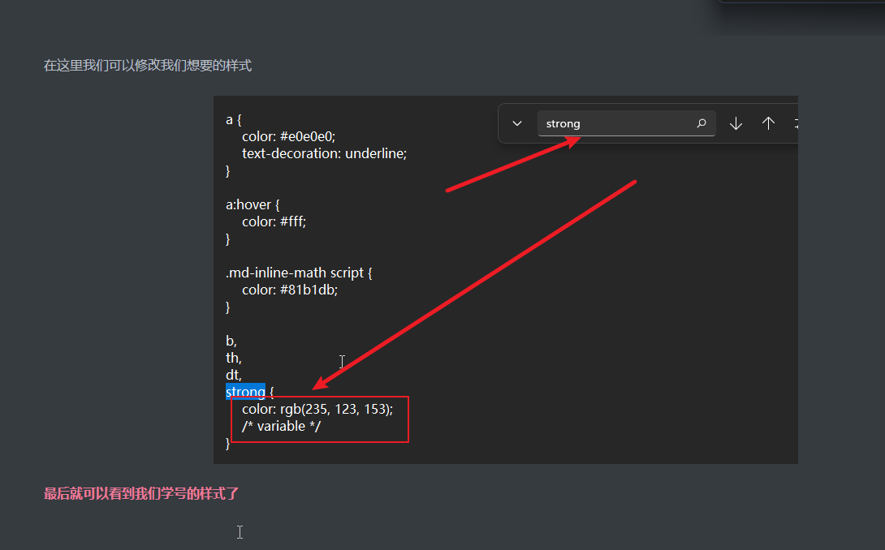

# 1. 前端开发基础

> 这一节只是一个前端学习的铺垫,  一些关于前端开发的拓展

## 1. 关于软件的了解


1. 是一系列按照特定顺序组织的电脑数据和指令，是电脑中的非有形部分. 电脑中的有形部分称为硬件，由电脑的外壳及各零件及电路所组成. 电脑软件需有硬件才能运作，反之亦然，软件和硬件都无法在不互相配合的情形下进行实际的运作.
   
2. 软件开发就是告诉计算机一系列的指令，这些指令也称之为程序.


3. 开发软件的这部分人就称之为软件开发工程师，也称之为程序员.


### 1. 生活中的软件有什么

例如微信,  抖音,  王者荣耀,  网易云音乐,  淘宝,  斗鱼,  哔哩哔哩,  `vscode`


### 2. 软件与应用程序的区别

软件（`software`）是下图所有的部分, 包含有应用程序, 而应用程序（`Application`）只是用户使用的, 面向普通的用户使用



### 3. 完整的系统软件

> 网易云为例

每个公司都会有一个服务器用于提供数据, 我们通常向该服务器发送请求获取数据

不同的编程语言会有不同的应用场景, 所以不要在意谁是最好的语言, 只需要明白前端开发最重要的是 `JavaScript` 这一门语言就好了, 如果时间允许, 可以深入了解 `css`

完善的应用程序开发需要包含有`服务器`开发, `iOS` 开发, `Android` 开发, `web` 开发, `桌面`开发



## 2. 开发分工

所有的开发者我们称之为软件开发工程师

### 1. 按照职能的不同也可以划分两类

后端（`Back-end`）开发，称之为后端开发工程师；

前端（`Front-end`）开发，称之为前端开发工程师；

### 2. 前端开发的职责

主要负责的：`Web（网站、后台管理系统、手机H5）、小程序端`

也可以做：移动端（`Uniapp、React Native`）、桌面端（`Electron`）、服务器开发（`Node.js`）

## 3. 前端发展的前景




### 1. 时代背景

新框架（`Ember.js、Preact.js`）、框架更新迭代（`vue3、react18`）、新工具（`Vite`）、新模式（`工程化、低代码、微前端`） 层出不穷；

此时的前端已经是卷中卷了, `Java`35岁危机, `前端`30岁危机

但是`高级前端开发工程师`人才需求大、薪资高

### 2. 前端能力的划分

> 初级程序员（薪资6k-10k，1~2年）

写一些简单的业务，负责项目某些模块的开发、维护；

遇到很多问题不知道如何处理，需要查询资料或者交流后可以解决；

代码通常写的杂乱无章，`能用就行`！

> 中级程序员（薪资10k-20k，2~4年）

可以独立负责中小型项目，负责公司项目核心业务的开发、维护； 

遇到大多数问题可以自行查到解决方案，有一定的自学能力，通过官网文档可以自学；

代码质量较高，`遵守代码规范`，并且会对组内其他人的代码有要求；

> 高级程序员（薪资20k-50k，4~6年）

独立负责中大型项目，可以为公司项目`搭建架构`，创建内部的`脚手架`，公司内部的`UI框架`；

可以读`懂框架源码`，并且从一些开源框架中借鉴优秀的`设计、架构、思想`；

公司的核心员工，`具备可替代性`，成为公司技术不可或缺的一部分；

> 系统架构师（50k~）

可以对大型项目进行`系统架构`，不再局限于某个领域（前端、后端?）或者某项技术（`JavaScript`、`Java`、 `C++?`）；

对技术领域 现有技术方案进行评估，对不同的场景给出对应的解决方案； 

确定项目最终方案，并且对整个项目进行“`核心架构`”（包括完成 核心架构 实现的能力）；

保证项目的各个环节有序进行，包括项目的高性能、高可用、可扩展能力；

> 资深技术专家（50k~）

专注于某一个特定领域

比如前端包括不限于对框架源码、`node`、`js引擎`进行定制化需求、优化；

比如后端包括不仅限于`JVM`、`线程池`、`SQL调试`、`优化`；

比如可以主导公司项目某些特定领域技术的落地，类似`流媒体`、`即时通信技术`等； 

某些人在行业内有一定的影响力，是某一块技术领域的Top人物；


## 4. 电脑配置

### 1. 显示隐藏后缀名



### 2. 推荐软件

> Chrome浏览器：开发必备浏览器

https://www.google.cn/chrome/index.html

> VSCode编辑器：开发推荐编辑器（编写代码）

https://code.visualstudio.com/

> WebStorm编辑器

https://www.jetbrains.com/zh-cn/webstorm/

> Xmind Zen思维导图：思维导图笔记

https://www.xmind.cn/

> Typora：markdown笔记软件

## 5. 网页, 网站与服务器

### 1. 网页与网站

#### 1. 网页网站的定义


- 网页的专业术语叫做 `Web Page`；


- 打开浏览器查看到的页面，是网络中的一“页”；


- 网页的内容可以非常丰富：包括`文字、链接、图片、音乐、视频`等等


- 而网站是由多个网页组成的


#### 2. 网页的显示过程 

1. 用户在浏览器输入一个`域名`, 通过 `DNS 服务器`解析成 `IP地址`；


2. 浏览器会找到对应的`IP地址`，请求`静态资源`；


3. 服务器返回静态资源给浏览器；


4. 浏览器对静态资源进行解析和展示；




#### 3. 服务器的静态资源开发


1. 前端工程师开发项目（`HTML/CSS/JavaScript/Vue/React`） 


2. 运维打包、部署项目到服务器里面

### 2. 网页的组成



> 阶段一：`HTML元素`；

`HTML元素` 用于写页面的结构

最早的网站: http://info.cern.ch/hypertext/WWW/TheProject.html, 那个时代的天才之作



> 阶段二：`HTML元素` + `CSS样式`；

`css样式`开始对页面的修饰

> 阶段三：`HTML元素` + `CSS样式` + `JavaScript语言`；

`JavaScript语言` 用于与用户的交互

### 3. 服务器

> 我们日常生活接触到的基本都属于客户端、前端的内容

比如浏览器、微信、QQ、小程序

> 但是手机并不可能存放哪些多的数据和资源

比如你用《网易云听音乐》，音乐数据大部分都是存在“`服务器`”中的

#### 1. 服务器的定义

服务器本质上也是一台类似于你电脑一样的主机

二十四小时不关机的（稳定运行）

没有显示器的

一般装的是`Linux操作系统`（比如`centos`）

## 6. 浏览器

### 1. 浏览器内核

首先解释一下浏览器内核是什么东西。英文叫做：`Rendering Engine`，中文翻译很多，排版引擎、解释引擎、渲染引擎，现在流行称为浏览器内核.

浏览器内核包括两部分，`渲染引擎`和`js引擎。`

- `渲染引擎`负责读取网页内容，整理讯息，计算网页的显示方式并显示页面
- `js引擎`是解析执行`js`获取网页的动态效果。 后来 `JS引擎`越来越独立，内核就倾向于只指渲染引擎。

> `渲染引擎`

浏览器所采用的「`渲染引擎`」也称之为「`浏览器内核`」，用来解析 `HTML`与`CSS`。

渲染引擎负责取得网页的内容（`HTML、XML、图像`等等）、整理讯息（例如加入` CSS` 等），以及计算网页的显示方式，然后会输出至显示器或打印机。

浏览器的内核的不同对于网页的语法解释会有不同，所以渲染的效果也不相同。所有网页浏览器、电子邮件客户端以及其它需要编辑、显示网络内容的应用程序都需要内核。

所以渲染引擎是浏览器兼容性问题出现的根本原因。

> `js引擎`

`JS 引擎`则是解析 `Javascript `语言，执行 `javascript `语言来实现网页的动态效果。

最开始`渲染引擎`和` JS 引擎`并没有区分的很明确，后来 `JS `引擎越来越独立，内核就倾向于只指渲染引擎。

> 作用

负责读取网页内容，整理讯息，计算网页的显示方式并显示页面.

> 流行的浏览器

| 浏览器    |       内核       | 备注                                                         |
| :--------: | :--------------: | :----------------------------------------------------------- |
| `IE`      |    `Trident`     |                                                              |
| `firefox` |     `Gecko`      |                                                              |
| `Safari`  |     `webkit`     |                                                              |
| `chrome`  | `Chromium/Blink` | 在 `Chromium `项目中研发 `Blink `渲染引擎（即浏览器核心），内置于 `Chrome `浏览器之中。`Blink `其实是 `WebKit `的分支。 |
| `Opera`   |     `blink`      |                                                              |



> 不同内核导致的场景

不同的浏览器内核有不同的解析、渲染规则，所以同一网页在不同内核的浏览器中的渲染效果也可能不同。

> 拓展阅读

移动端的浏览器内核主要说的是系统内置浏览器的内核。00

## 7. Markdown 语法

`Markdown`是一种轻量级标记语言，它允许人们使用易读易写的纯文本格式编写文档，然后转换成有效的`XHTML`(或者`HTML`)文档。

`Markdown` 的目标是实现「易读易写」。`Markdown` 的语法十分简单。常用的标记符号也不超过十个，这种相对于更为复杂的`HTML` 标记语言来说，`Markdown` 可谓是十分轻量的，学习成本也不需要太多，且一旦熟悉这种语法规则，会有一劳永逸的效果。

### 1. Markdown 标题

使用 `#` 号可表示 1-6 级标题，一级标题对应一个 `#` 号，二级标题对应两个 `#` 号，以此类推。

```markdown
# 一级标题

## 二级标题

### 三级标题

#### 四级标题

##### 五级标题

###### 六级标题

注意：'#'与标题之间需要空格隔开
```

### 2. Markdown 字体

```markdown
// 加粗
**你好，世界**

// 代码高亮显示
==Hello,World!==

// 删除线
~~被删除的文字~~

// 斜体
*斜体*
_斜体_
```

### 3. Markdown 列表

`Markdown` 支持有序列表和无序列表。

> 无序列表

```markdown
// 无序列表
* 无序列表 第一项
* 无序列表 第二项
* 无序列表 第三项

+ 无序列表 第一项
+ 无序列表 第二项
+ 无序列表 第三项

- 无序列表 第一项
- 无序列表 第二项
- 无序列表 第三项
```

> 有序列表

有序列表使用数字并加上 `.` 号来表示：

```markdown
// 有序列表
1. 第一项
2. 第二项
3. 第三项
// 注意：列表符和列表名称之间有空格
```

### 4. Markdown 引用

几个尖括号就代表前面有几条竖线

```markdown
> 
```

### 5. Markdown 表格

`Markdown `制作表格使用 `|` 来分隔不同的单元格，使用 `-` 来分隔表头和其他行：

```markdown
// ---: 设置内容和标题栏居右对齐。
// :--- 设置内容和标题栏居左对齐。
// :---: 设置内容和标题栏居中对齐。
|  表头   | 表头  |
|  ----  | ----  |
| 单元格  | 单元格 |
| 单元格  | 单元格 |
```

### 6. Markdown 图片

`Markdown `图片语法格式如下：

```markdown
// 开头一个感叹号 !
// 接着一个方括号，里面放上图片的替代文字
// 接着一个普通括号，里面放上图片的网址，最后还可以用引号包住并加上选择性的 'title' 属性的文字。


```

### 7. Markdown 链接

链接使用方法如下：

```markdown
[链接名称](链接地址)
```

## 8. Typora 的自定义样式

找到你使用主题对应的 `css` 文件


在这里我们可以修改我们想要的样式



最后就可以看到我们的样式了




# @补充


1. `《JavaScript高级程序设计》`的作者`Nicholas C.Zakas` 在他的博客有说到： 想要全面的掌握`JavaScript`，关键在于弄清楚它的历史、局限性和本质


2. `css3` 并没有真正意义上的标准
